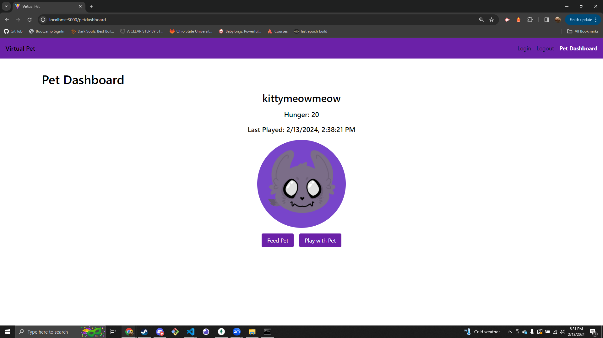

# Virtual Pet 

## Description

This site is for users who love animals to adopt and interact with their own! You can choose from a select few of hand-made creatures.

## Table of Contents
[Usage](#usage)
[License](#license)
[Contributing](#contributing)
[Questions](#questions)

## Usage

Create an account [here](https://petappthingy-aa69f1e65e58.herokuapp.com/). You will be prompted to adopt a pet when you do this. After you name your pet, you will see the Pet Dashboard page. From there 
you can both feed your newly adopted pet and give it some pats to raise it's happiness. When you are done playing, hit the `Logout` button to finish and leave!

## License
[MIT License](https://opensource.org/license/mit/)

Copyright (c) 2024 PurplePeopleEated

Permission is hereby granted, free of charge, to any person obtaining a copy
of this software and associated documentation files (the "Software"), to deal
in the Software without restriction, including without limitation the rights
to use, copy, modify, merge, publish, distribute, sublicense, and/or sell
copies of the Software, and to permit persons to whom the Software is
furnished to do so, subject to the following conditions:

The above copyright notice and this permission notice shall be included in all
copies or substantial portions of the Software.

THE SOFTWARE IS PROVIDED "AS IS", WITHOUT WARRANTY OF ANY KIND, EXPRESS OR
IMPLIED, INCLUDING BUT NOT LIMITED TO THE WARRANTIES OF MERCHANTABILITY,
FITNESS FOR A PARTICULAR PURPOSE AND NONINFRINGEMENT. IN NO EVENT SHALL THE
AUTHORS OR COPYRIGHT HOLDERS BE LIABLE FOR ANY CLAIM, DAMAGES OR OTHER
LIABILITY, WHETHER IN AN ACTION OF CONTRACT, TORT OR OTHERWISE, ARISING FROM,
OUT OF OR IN CONNECTION WITH THE SOFTWARE OR THE USE OR OTHER DEALINGS IN THE
SOFTWARE.

## Contributing

Team:
- Elliott Gibson-Creech
- Grant Wolff
- Karra Maynard

Articles Used:
- [MDN Docs](https://developer.mozilla.org/)
- [w3schools](https://www.w3schools.com/)
- AI Assistant

## Questions

- GitHub: [Elliott's Profile](https://github.com/Silverfoot42)
- GitHub: [Grant's Profile](https://github.com/Neongreen64)
- GitHub: [Karra's Profile](https://github.com/PurplePeopleEated)